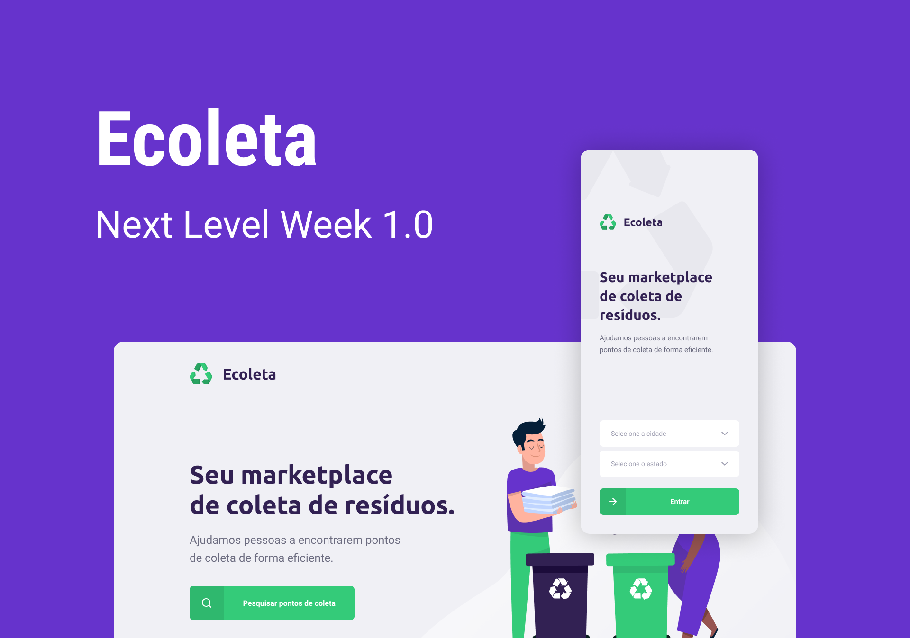

<h3 align="center">
    
    <b><h1>Ecoleta</h1></b>  
  <a href="https://rocketseat.com.br">
    
  </a>
  <a>
  
  <br><br>
  <a href="https://insomnia.rest/run/?label=Ecoleta&uri=https%3A%2F%2Fraw.githubusercontent.com%2Fvitorserrano%2Fecoleta%2Fmaster%2F.github%2FInsomnia_2020-06-05.json" target="_blank"></a>
</p>
</h3>

## :recycle:	Ecoleta: Seu marketplace de coleta de resíduos.
<p> A Funcionalidade da aplicação Ecoleta consiste em cadastrar pontos de coleta seletiva em qualquer lugar. </p>
<p> A Coleta Seletiva possui um papel importantíssimo para o meio ambiente seguindo o objetivo de fazer com que vários tipos de resíduos sigam seu caminho para reciclagem ou destinação final ambientalmente correta.</p>

## :desktop_computer:	 Tecnologias Utilizadas

- [Node.js](https://nodejs.org/en/)
- [Expo](https://expo.io/)
- [React](https://pt-br.reactjs.org/)
- [React Native](https://reactnative.dev/)
- [TypeScript](https://www.typescriptlang.org/)
- [Knex](http://knexjs.org/)

## <dt> :gear: Instalações </dt>

```shell 

  $ npm install express
  $ npm install ts-node
  $ npm install typescript
  $ npm install react-icons
  $ npm install react-router-dom
  $ npm install axios
  $ npm install cors
  $ npm install multer
  $ npm install react-dropzone
  $ npm install celebrate

```

## :rocket: Executar a Aplicação

```sh

  ## Backend
  $ cd server
  $ npm run dev

  # Frontend
  $ cd web
  $ npm start

  # Mobile
  $ cd mobile
  $ npm start
```
## :purple_heart: Template

